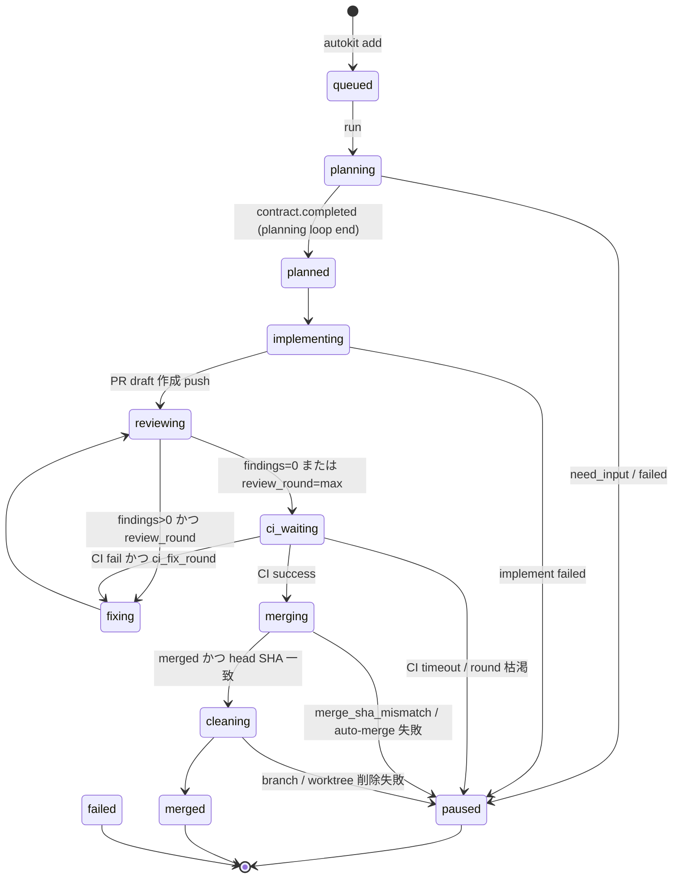
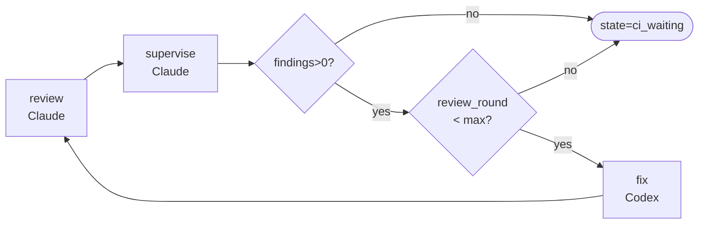
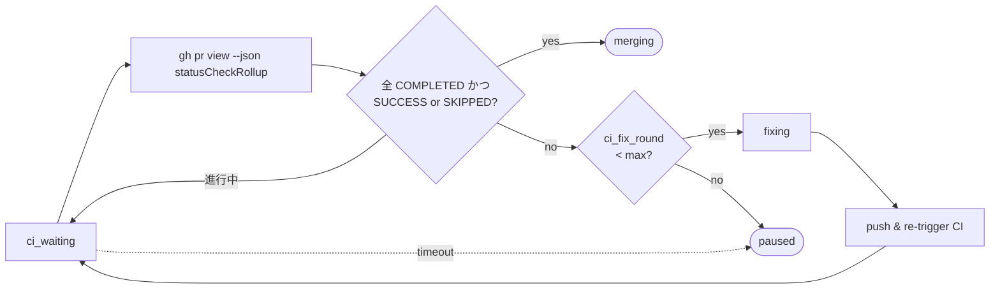

# 03. 状態機械

> state 遷移と各 state の不変条件。SPEC §5 の要約 + 設計視点での補足。

## 全 state



正典は [SPEC §5.1 state 遷移表](../SPEC.md)。

## state 分類

```mermaid
flowchart LR
  subgraph terminal["終端 (run の処理対象外)"]
    merged
    failed
  end
  subgraph waiting["待機 (人手復帰)"]
    paused
  end
  subgraph active["進行中"]
    queued
    planning
    planned
    implementing
    reviewing
    fixing
    ci_waiting
    merging
    cleaning
  end

  active -.-> waiting: 中断
  active -.-> terminal: 完了 / 諦め
  waiting -.-> active: resume / retry
```

`autokit run` は active な task を 1 件取り、terminal/waiting に達するまで loop（最大 100 step）。

## 不変条件

| state | 必ず成り立つもの | 違反すると |
|-------|-----------------|-----------|
| `planning` | `task.plan.path` が決まっている | plan 書き込み失敗 → `paused` |
| `planned`/`implementing` | `branch` ≠ null, `worktree_path` ≠ null | `ensureWorktree` で作る前提 |
| `reviewing` | `pr.number` ≠ null かつ `pr.head_sha` ≠ null | review 不可 → `paused` |
| `fixing` | `pr.head_sha` が実 PR と一致 | sanitize 規則違反でも `paused` |
| `ci_waiting` | `pr.number` ≠ null | CI チェック取得不能 |
| `merging` | `auto_merge=true` の場合 head SHA 一致を確認済み | `merge_sha_mismatch` で `paused` |
| `cleaning` | PR が `MERGED && merged && head SHA 一致` | `force-detach` でしか進められない |
| `merged` | `cleaning_progress.*` 全 done | retry の対象外 |

## ループ構造

各 state 内部にループを持つフェーズがある:

### 1. planning ループ（plan ↔ plan_verify ↔ plan_fix）

```mermaid
flowchart LR
  S([state=planning]) --> P[plan<br/>Claude]
  P --> V[plan_verify<br/>Codex]
  V --> D{verify ok?}
  D -- yes --> Done([state=planned])
  D -- no --> F[plan_fix<br/>Claude]
  F --> V
  V -. round = plan.max_rounds .-> Paused([paused])
```

上限: `config.plan.max_rounds`（デフォルト 4）。

### 2. レビューループ（review ↔ supervise ↔ fix）



上限: `config.review.max_rounds`（デフォルト 3）。`warn_threshold`（デフォルト 2）以降は warn ログ。

### 3. CI / fix ループ



上限: `config.ci.fix_max_rounds`（デフォルト 3）/ `config.ci.timeout_ms`（30 分）。

## paused からの再エントリ点

`paused` は中断箇所を `runtime_phase` に保持。`autokit run` 再実行時は **同じ runtime_phase から再入** する（`failure.code` がそれを許す場合）。

正典: [SPEC §5.1.3 paused → resume 復帰先](../SPEC.md)。

| 直前の runtime_phase | 復帰先 state |
|---------------------|------------|
| `plan` / `plan_verify` / `plan_fix` | `planning` |
| `implement` | `implementing` |
| `review` / `supervise` | `reviewing` |
| `fix` | `fixing` |
| (CI 待ち / merge 中の paused) | それぞれ `ci_waiting` / `merging` |

`runtime_phase` は terminal state（`merged` / `failed`）では `null` に落ちる（[SPEC §5.1.2](../SPEC.md)）。

## state を増やすときの設計指針

新フェーズを足したい場合:

1. `core/config.ts` の `runtimePhases` に追加
2. `core/state-machine.ts` の遷移ホワイトリストに追加
3. `phasePromptContracts` に prompt-contract を割当
4. `workflows/src/index.ts` に `runXxxWorkflow` を追加し、`paused` 帰着のすべての failure path を網羅
5. `cli/executor.ts` の dispatch 分岐を追加
6. `failure-codes.ts` に新しい failure code を追加（再開可否を含めて分類）
7. SPEC §5 / §4.2.1.1 を同時更新

「**追加した state からも paused に落とせること**」が必須条件。落とせないフェーズを追加しない。
