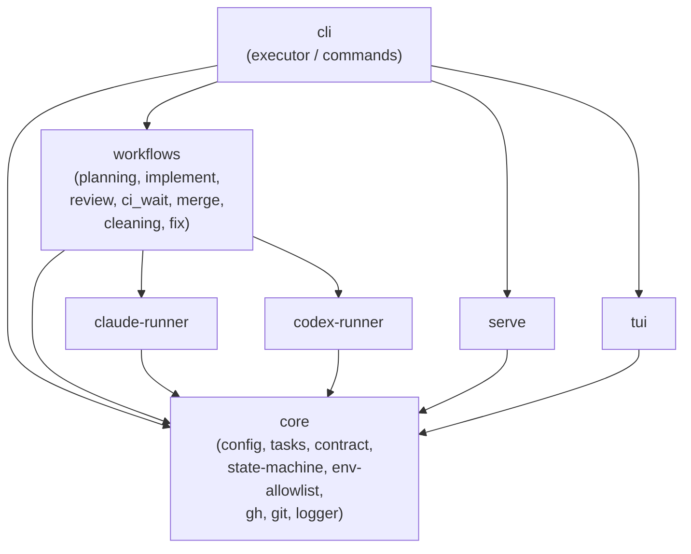
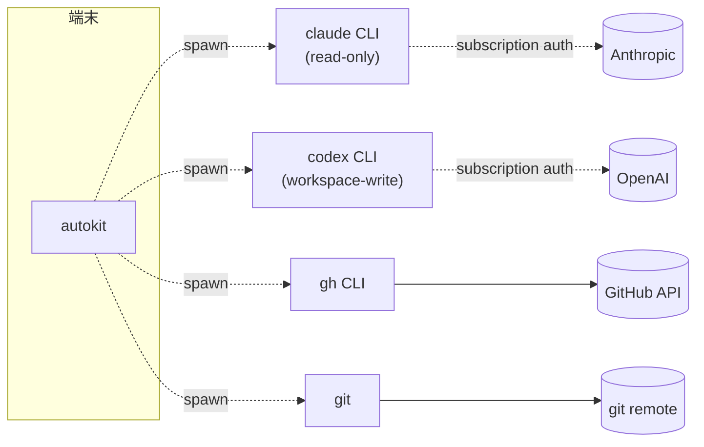
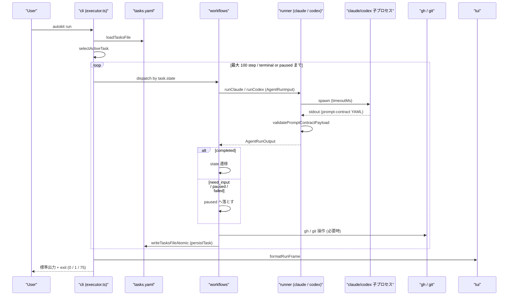
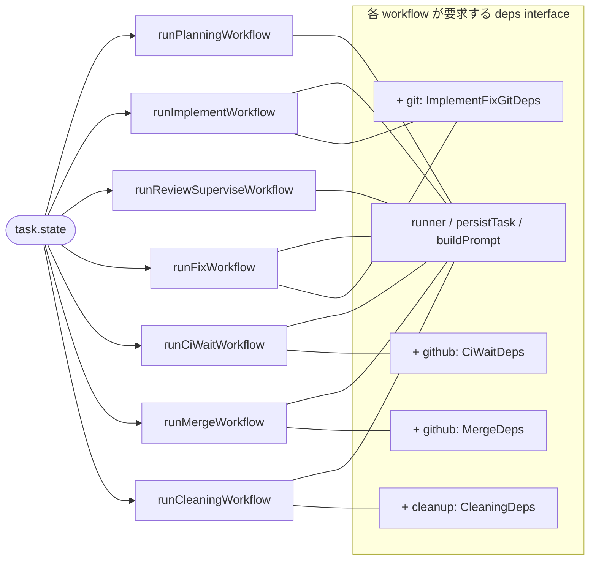
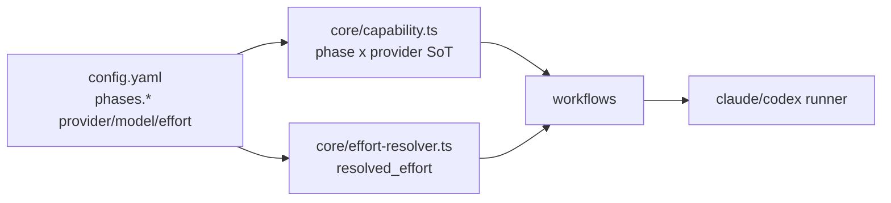
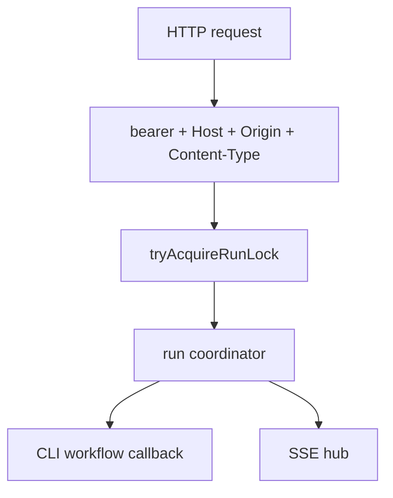

# 02. アーキテクチャ

> monorepo の構造と、`autokit run` 1 回で何が起きるか。

## monorepo パッケージ

```
packages/
├─ cli              # @cattyneo/autokit          Commander entrypoint, 配布対象
├─ workflows        # @cattyneo/autokit-workflows フェーズ別ステートマシン
├─ core             # @cattyneo/autokit-core     型, config, tasks, env, contract, gh/git ヘルパ
├─ claude-runner    # @cattyneo/autokit-claude-runner   Claude CLI ラッパ (read-only)
├─ codex-runner     # @cattyneo/autokit-codex-runner    Codex CLI ラッパ (workspace-write)
├─ serve            # @cattyneo/autokit-serve    local HTTP API / SSE server
└─ tui              # @cattyneo/autokit-tui      Ink ベース TUI
```

## 依存方向



依存は単方向。`core` は他パッケージに依存しない。`workflows` は runner に依存するが、runner は `WorkflowRunner` 型 (`(input: AgentRunInput) => Promise<AgentRunOutput>`) で抽象化されている。

## 外部プロセス

`autokit` は **長寿命プロセスを持たない**。すべての外部 I/O は子プロセス起動。



子プロセスに渡す環境変数は `core/env-allowlist.ts` の allowlist で絞る:

| ターゲット | 受け渡す key |
|------------|-------------|
| `gh` (`buildGhEnv`) | `PATH`, `HOME`, `USER`, `LOGNAME`, `LANG`, `TERM`, `TZ`, `LC_*`, `XDG_CONFIG_HOME`, `XDG_CACHE_HOME`, `GH_TOKEN`, `GITHUB_TOKEN` |
| runner (`buildRunnerEnv`) | 上記から `GH_TOKEN` 系を除外、`HOME` / `XDG_*` を `options` で上書き可能 |

`ANTHROPIC_API_KEY` / `OPENAI_API_KEY` / `CODEX_API_KEY` は **どの allowlist にも含まれない**。

## `autokit run` のデータフロー



要点:

- **`tasks.yaml` への書き込みは executor を経由しない**。`workflows` の各 `runXxxWorkflow` が `persistTask` callback を呼び、その実体が `cli/executor.ts` 内で atomic write する
- runner は **stateless**。session id (`claudeSessionId`, `codexSessionId`) を介してのみ resume される
- `gh` / `git` 呼び出しは `core/gh.ts` `core/git.ts` の **コマンドビルダー関数** を経由。直接文字列連結しない（インジェクション防止）

## `core` の主要モジュール

| モジュール | 責務 |
|------------|------|
| `config.ts` | `AutokitConfig` の Zod schema / `DEFAULT_CONFIG` / phase ↔ provider マッピング |
| `capability.ts` | 7 agent phase × 2 provider の capability table / permission profile derive |
| `effort-resolver.ts` | `auto` / `low` / `medium` / `high` の解決、downgrade audit candidate |
| `tasks.ts` | `TaskEntry`, `TasksFile` 型と atomic write |
| `state-machine.ts` | state 遷移のホワイトリスト・正当性検証 |
| `runner-contract.ts` | `AgentRunInput` / `AgentRunOutput` / prompt-contract validation |
| `env-allowlist.ts` | 子プロセス env の allowlist |
| `failure-codes.ts` | `failure.code` の固定列挙 |
| `gh.ts` / `git.ts` | コマンド引数ビルダー |
| `logger.ts` | 構造化ログ + redact + 監査イベント |
| `process-lock.ts` | `.autokit/.lock/` の cross-process lock |
| `assets-writer.ts` | init / preset apply で共有する atomic asset write primitive |
| `reconcile.ts` | tasks.yaml と GitHub 状態の差分突合 |
| `retry-cleanup.ts` | retry の cleanup 手順 |
| `pr.ts` | PR 状態 parse |
| `model-resolver.ts` | `model: auto` の解決 |

## `workflows` パッケージの構造

`workflows/src/index.ts` 1 ファイルに各フェーズの runXxxWorkflow を export:



deps は CLI 側 (`cli/executor.ts`) で組み立てられる。テストは deps を mock することで子プロセスを起動せずに workflows を単体検証できる。

## capability / effort の所有境界

v0.2.0 では provider 選択と権限を runner package 側に分散しない。



- `(phase, provider)` は `capability.ts` で検証する。
- permission profile は provider ではなく phase から導出し、CLI override で変更できない。
- `ci_wait` / `merge` は core-only step。runner dispatch / provider / effort の対象外。
- `resolveRunnerTimeout(config, phase, resolvedEffort)` は runner に渡す timeout を必ず number に解決する。

## `serve` パッケージの構造

`serve` は `node:http` ベースの local API server。CLI package から起動されるが、workflow 実行は `runWorkflow` callback に閉じ込める。



read endpoint も bearer + Host gate を通す。mutating endpoint は lock busy で HTTP 409 (`serve_lock_busy`) を返し、`failure.code` や `tasks.yaml` task entry は作らない。

## アーティファクト

`autokit run` が触る永続物（[user-guide/04](../user/04-configuration.md) 参照）:

```
.autokit/
  tasks.yaml                state（atomic write）
  audit-hmac-key            HMAC 鍵
  init-audit.jsonl          init rollback 監査
  logs/                     構造化ログ
  reviews/                  issue-{N}-review-{round}.md
  worktrees/                git worktree 実体
<task.plan.path>            plan Markdown
```

書き込み権は **常に 0o600 / 0o700**。runner はこれらを直接書かず、必ず `persistTask` 等の callback を経由する。

## 関連

- 状態遷移詳細: [03-state-machine.md](./03-state-machine.md)
- runner ↔ workflow の契約: [04-prompt-contract.md](./04-prompt-contract.md)
- 安全境界: [05-safety.md](./05-safety.md)
