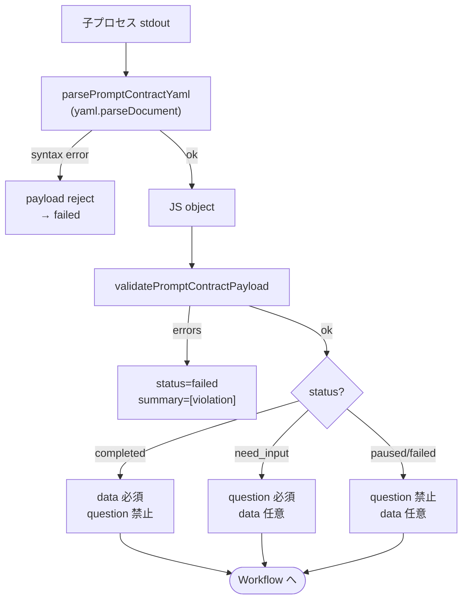
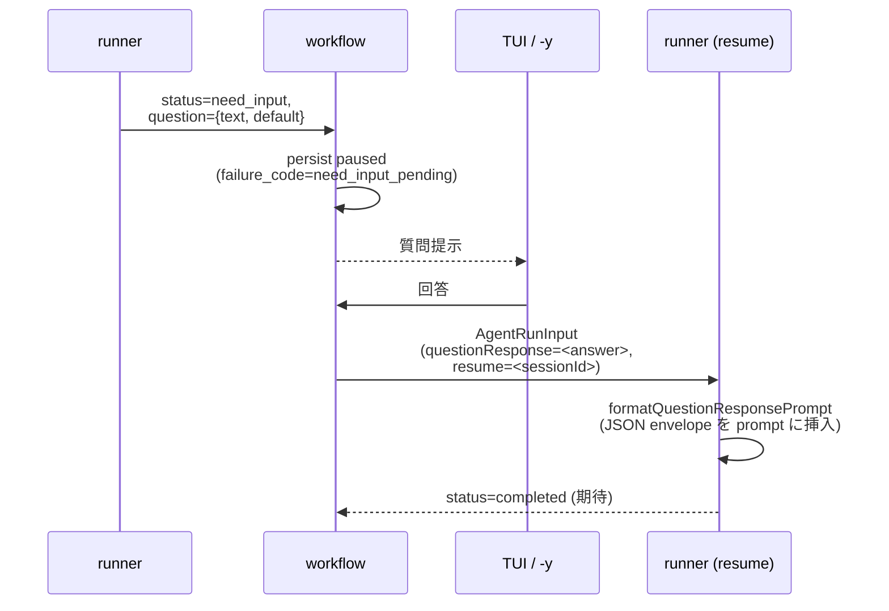

# 04. Prompt Contract

> runner（Claude / Codex 子プロセス）と workflow を結ぶインターフェース定義。自由テキストを返させない仕組み。

## 動機

LLM の自由出力を実装側が文字列パースで解釈すると:

- 「成功した気になって failed を見逃す」
- 「`completed` だが何も書いていない」
- 「`need_input` の質問が無いまま停止」

を検出できない。**runner の出力を構造化 + schema 検証** で機械的に拒否することで、上記事故を **未然に paused へ落とす**。

## 入出力型

`packages/core/src/runner-contract.ts`:

```mermaid
flowchart LR
  subgraph in["AgentRunInput"]
    in1[provider]
    in2[phase]
    in3[promptContract]
    in4[model]
    in5[permissions<br/>auto/readonly/workspace-write]
    in6[timeoutMs]
    in7[prompt]
    in8[resume?<br/>session ids]
    in9[questionResponse?]
  end

  subgraph runner["runClaude / runCodex"]
    spawn[child spawn]
    parse[parse YAML stdout]
    validate[validatePromptContractPayload]
  end

  subgraph out["AgentRunOutput"]
    o1[status:<br/>completed/need_input/<br/>paused/rate_limited/failed]
    o2[summary]
    o3[structured?<br/>contract data]
    o4[question?]
    o5[session?]
    o6[resolvedModel?]
  end

  in --> runner --> out
```



`AgentRunStatus` の取り得る値:

```
completed | need_input | paused | rate_limited | failed
```

`rate_limited` は runner 側で挿入する集約状態。prompt-contract（LLM 出力 YAML）には現れない。

v0.2.0 の `AgentRunInput` は、上記に加えて `effort` / `effective_permission` / `promptContract` を runner へ渡す。runner は provider 固有の CLI 引数へ変換するだけで、capability 判定や permission profile の緩和は行わない。

## 検証フロー



contract ごとに `data` フィールドのスキーマが異なる（`promptContractJsonSchema(contract)`）。代表:

| contract | `data` の主要フィールド |
|----------|----------------------|
| `plan` | plan 内容（Markdown を含む構造） |
| `plan-verify` | findings: `PlanVerifyFinding[]` |
| `plan-fix` | 修正内容 |
| `implement` | commit 情報 / 変更ファイル等 |
| `review` | findings: `ReviewFinding[]` |
| `supervise` | findings の取捨判定 |
| `fix` | 適用した変更 |

正典スキーマは `runner-contract.ts: dataJsonSchemaFor(contract)` および SPEC §4.5 / §4.6。

## 共通制約

- payload は **オブジェクト**。配列やスカラーは reject
- 未知キーは reject（`rejectUnknownKeys`）
- `summary` は最大 16 KiB
- `question.text` / `question.default` も最大 16 KiB
- `status` 列挙外は reject
- 各 status × 各 contract の組合せで `data` 形が決まる

## need_input の往復



answer は `autokit_need_input_response` という JSON envelope に包まれて prompt に挿入される（`formatQuestionResponsePrompt`）。runner 側の prompt-contract 仕様書（`.agents/prompts/*.md`）でこの envelope を読み取り次の出力を返す約束になっている。

`-y` 経路は `cli/index.ts: createNeedInputAutoAnswer` が question.default を answer として返す。default が空なら **無理に進めず** paused のまま log に warn を残す。

## prompt-contract が解く問題

| 起こりうる runner 事故 | contract 検証で起きること |
|----------------------|-------------------------|
| 出力が markdown のみ | yaml parse 失敗 → failed |
| `status: success` | enum 違反 → failed |
| `completed` と書きつつ `data` なし | required violation → failed |
| `completed` で `question` も付ける | mutual exclusion violation → failed |
| `need_input` で question.text が空 | bounded string violation → failed |
| 回答済みなのに同じ質問を繰返 | session resume + envelope で一度きり |

**reject すれば paused に落ちて人手判断に委ねられる**。これが「自由テキスト解釈」より優れている理由。

## v0.2 asset gates

Phase 4 以降、prompt / skill / agent asset は次の gate を通る。

| gate | 検出対象 |
|------|----------|
| prompt asset visibility | `.agents/prompts/<contract>.md` が phase mapping と一致し、runner prompt に実本文が注入される |
| preset effective prompt | bundled preset の prompt overlay 後も prompt-contract mapping と marker 順序が壊れない |
| payload fixture | `validatePromptContractPayload` が全 phase の valid fixture を通す |
| Codex schema snapshot | `codexPromptContractJsonSchema(contract)` が frozen JSON snapshot と deepEqual |
| skill / agent visibility | `autokit-implement` / `autokit-review` / bundled agents が provider-visible root と capability boundary を満たす |

この gate は schema 変更を禁止するものではない。schema 変更が必要な場合は SPEC §9.3 と snapshot を同 PR で更新し、reviewer に意図を明示する。

## 関連

- 各 phase の prompt 本文: `.agents/prompts/<phase>.md` (init で配布)
- contract 検証実装: `packages/core/src/runner-contract.ts`
- contract data の正典: SPEC §4.5 / §4.6
