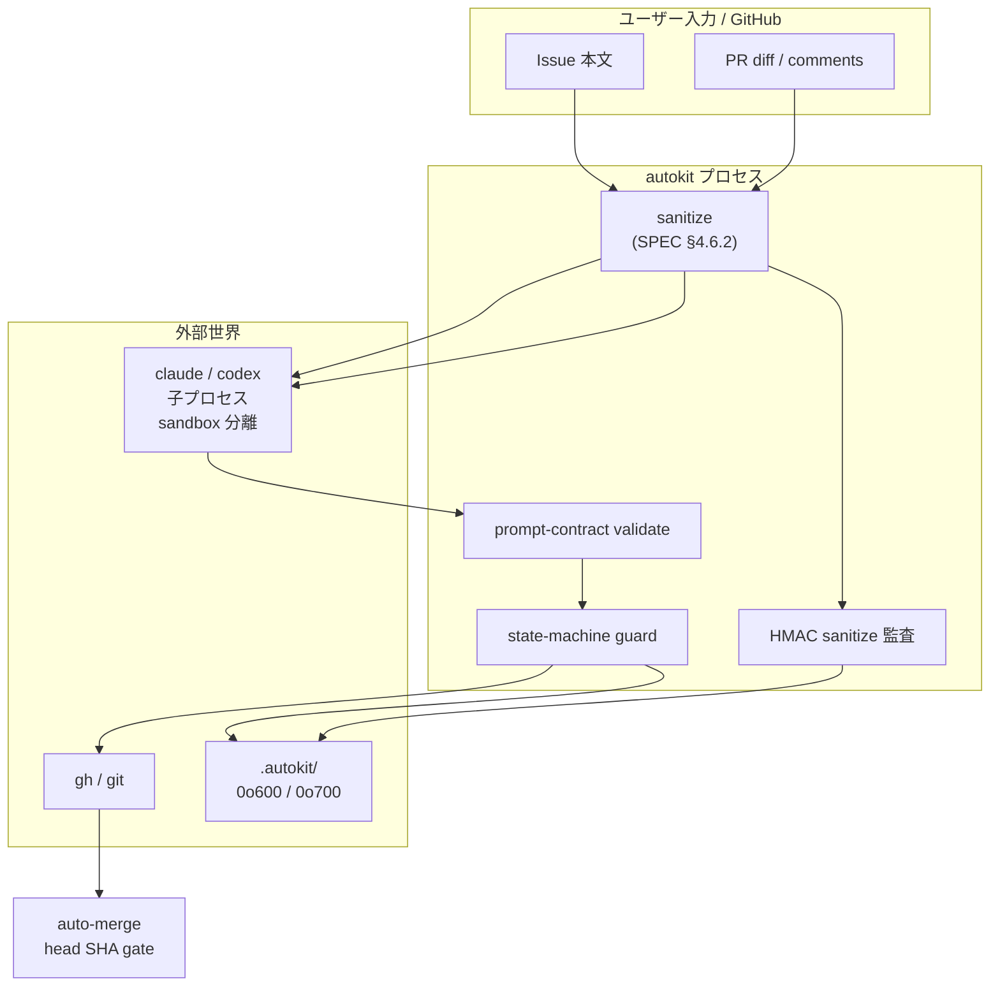
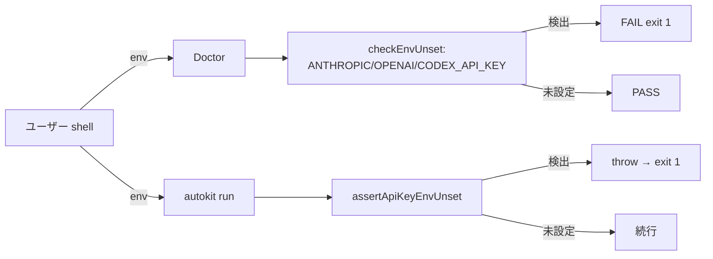
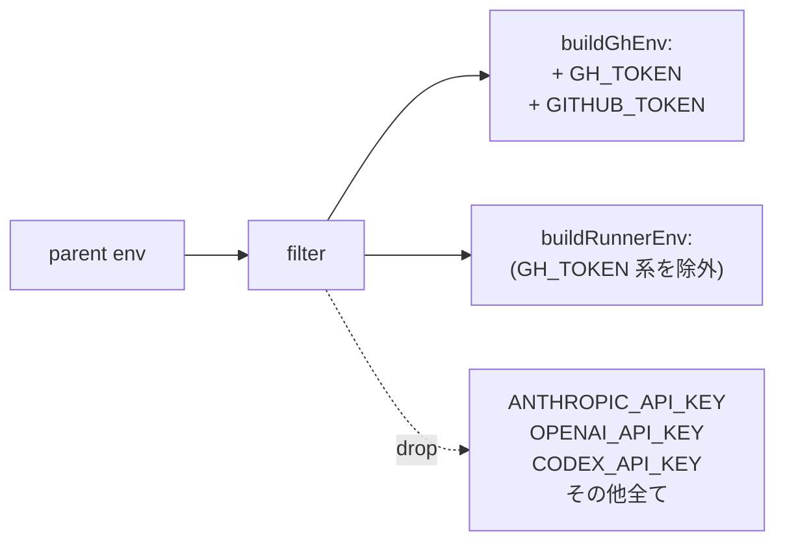
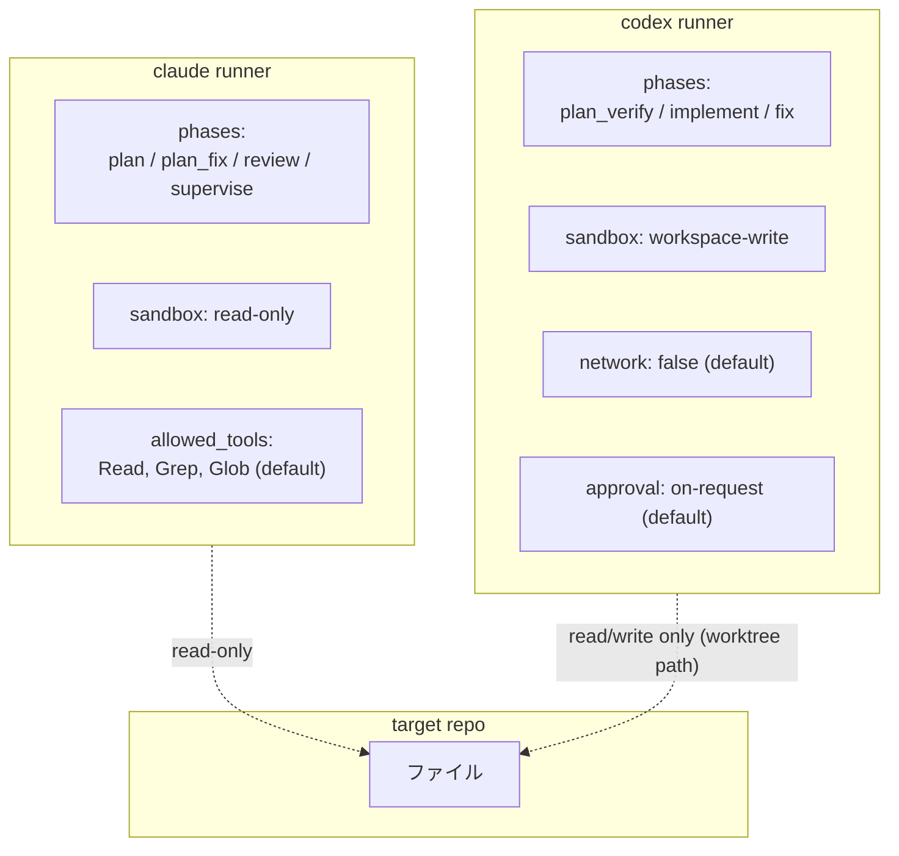
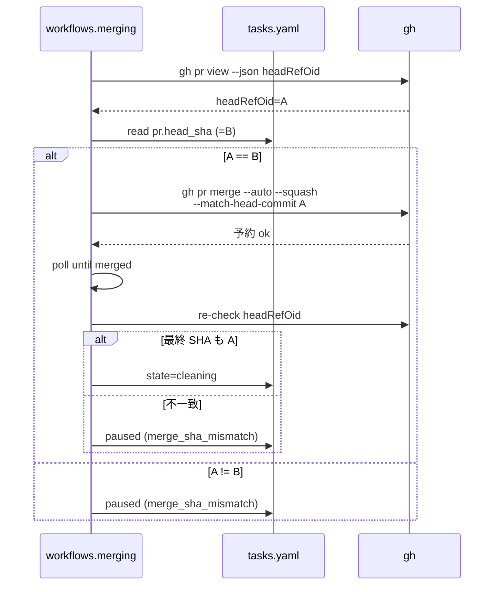
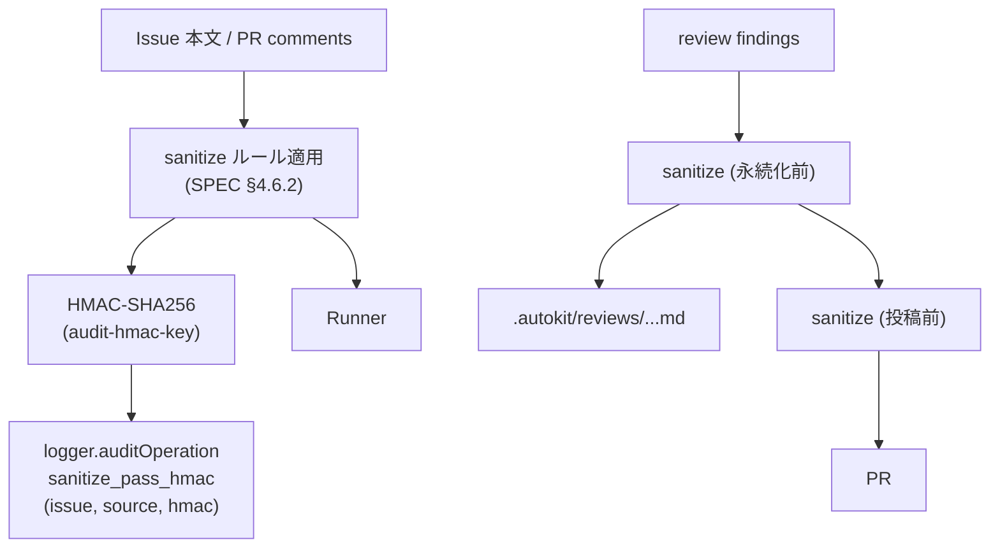
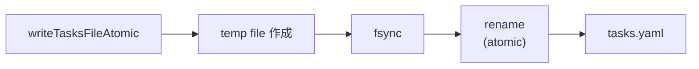
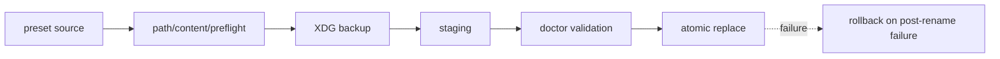

# 05. 安全設計

> 「壊さない・漏らさない・誤って merge しない」を支える 5 つの境界。

## 境界の地図



それぞれを順に見る。

## 1. API key 環境変数の禁止



加えて `.env*` ファイルにも書かれていないことを doctor が確認（`checkDotEnv`）。理由: subscription auth が API key 認証で上書きされる課金経路を作らせない。

## 2. 子プロセス env の allowlist

`core/env-allowlist.ts`:



`COMMON_EXACT_KEYS` (`PATH`, `HOME`, `USER`, `LOGNAME`, `LANG`, `TERM`, `TZ`) と `LC_*` のみ自動継承。それ以外は **明示登録** が必要。

「うっかり継承」が起きないため、新しい環境変数を runner に通したい場合は allowlist に追加するコード変更が要る。

## 3. sandbox 分離



役割分離の不変条件:

- **review / supervise は writeable runner に渡してはならない**（中立性 + 副作用なし）
- **codex の `allow_network: true` は `home_isolation: isolated` 必須**（schema validation）
- worktree scope は `worktree`（デフォルト）/ `repo` のいずれか。`worktree` で隔離する
- provider override は permission profile を変えない。`implement` / `fix` だけが write_worktree、`review` / `supervise` は provider が変わっても readonly_worktree のまま

## 4. auto-merge head SHA gate



`--match-head-commit` を **必ず付ける**。GitHub 側で head が変わると auto-merge が無効化される動作を利用し、レビュー後の追加 push を黙って merge してしまう経路を塞ぐ。

`autokit cleanup --force-detach` も同じ gate を再評価してから merged 化する。

## 5. sanitize と HMAC 監査



`audit-hmac-key` は init 時に 32 bytes random で生成、mode 0600。鍵を持つ者のみが「あの sanitize は本物のあの入力に対するものだった」を検証できる。

「永続化前」「投稿前」の両方で sanitize を通すことで、永続化スキップ → 投稿の経路でも redact 漏れが起きない。

## 6. ファイル / ディレクトリ permission

```
.autokit/                     0o700
  config.yaml                 0o600
  tasks.yaml                  0o600
  audit-hmac-key              0o600 (O_EXCL で生成)
  init-audit.jsonl            0o600
  reviews/issue-*-review-*.md 0o600
.agents/                      0o700
  prompts/, agents/, skills/  0o700
.claude/agents -> ../.agents/agents (symlink, target は ../.agents 内に拘束)
.claude/skills -> ../.agents/skills
.codex/agents -> ../.agents/agents
.codex/skills -> ../.agents/skills
```

`init` は **既存の symlink target が `.agents/` 外を指していないか**を verify (`validateExistingProviderLinks`)。違反したら `symlink_invalid:<path>` で abort。

## 7. atomic write と rollback



書き込み中の SIGKILL でも tasks.yaml が破損しない。corruption が起きた場合のみ `autokit retry --recover-corruption <issue>` の `loadTasksFile(restoreFromBackup: true)` 経路で復旧する。

`init` も同様に backup → 一括書き込み → 失敗時 rollback の構造（`packages/cli/src/init.ts: runInit`）。

## 8. 監査イベント

logger 経由で残すイベント:

| イベント | タイミング |
|---------|-----------|
| `sanitize_pass_hmac` | issue/findings sanitize 通過 |
| `effort_downgrade` | unsupported effort を `downgrade` policy で 1 段階下げた |
| `phase_self_correct` | prompt-contract 違反の初回 self-correction retry |
| `phase_override_started` / `phase_override_ended` | 1 run override の開始 / 終了 |
| `auto_merge_reserved` | auto-merge 予約成功 |
| `auto_merge_disabled` | auto-merge 無効化 |
| `branch_deleted` | remote branch 削除 |
| `init_rollback` | init 失敗時 rollback 完了 |
| `init_rollback_failed` | rollback 自体が失敗、backup 保持 |
| `preset_apply_*` | preset apply / rollback 境界 |
| `serve_lock_busy` | serve 経路で lock fast-fail 409 |
| `sse_write_failed` | SSE client write failure を workflow から隔離 |

これらは `.autokit/logs/` に出る。順序付き JSON Lines。`logging.redact_patterns` でログ出力時に追加マスクされる（github token / API key 形）。

## 9. preset apply 境界

`autokit preset apply` は `.agents/` と `.autokit/config.yaml` を更新するため、runner とは別の高リスク write path。



fail-closed 条件:

- path traversal は `preset_path_traversal`
- blacklist / content signature / protected array 違反は `preset_blacklist_hit`
- `tasks.yaml` task entry は作らない
- apply backup は repo tree 外の `${XDG_STATE_HOME:-~/.local/state}/autokit/backup/<repo-id>/...`
- rollback failure は `preset_apply_rollback_failed` audit と復旧手順を出し、壊れた `.agents` が残り得ることを隠さない

## 10. serve API 境界

`autokit serve` は local API だが、GitHub PR / merge / cleanup を起動できるため browser-origin 攻撃を前提に守る。

| 境界 | 契約 |
|------|------|
| bind | 既定 `127.0.0.1`。`0.0.0.0` / `::` は起動拒否 |
| token | 32 byte CSPRNG、毎起動 regenerate、file mode `0600`、Bearer header のみ |
| Host | `127.0.0.1` / `localhost` / `[::1]` の port 完全一致 |
| Origin | 同一オリジンか header 欠落のみ許可。`Origin: null` は 403 |
| Content-Type | mutating endpoint は `application/json` 必須 |
| lock | `.autokit/.lock/` を取得できない mutating request は 409 `serve_lock_busy` |
| SSE | closed kind list、runner stdout は debug level のみ、redactor と frame cap を通す |

## まとめ

```
ユーザー入力 → sanitize → runner
runner 出力  → contract 検証 → state-machine
state        → atomic write → tasks.yaml (0o600)
gh 操作      → head SHA gate → auto-merge
serve/preset → lock + auth/path gate → state or assets
全イベント   → HMAC 監査 → logs (redact 適用)
```

これらのうち 1 つでも欠けたら設計が壊れる。新しいフェーズや拡張を入れるときは、すべての境界を通過するか必ず確認する。
